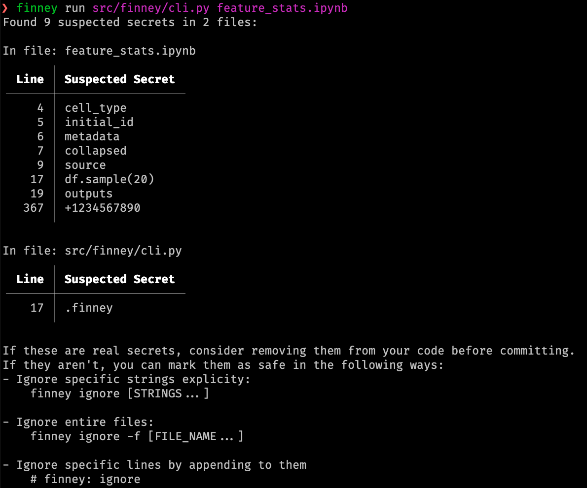

# FINNEY

FINNEY is a quick and easy tool to prevent accidentally committing passwords and secrets to your code repositories.

## Installation & Setup
To install FINNEY, run the following commands in your terminal:

```shell
pip install pre-commit
pip install finney
```

To configure it in your project, create a file named `.pre-commit-config.yaml` in the root of your repository, paste the following configuration into it:
```yaml
repos:
  - repo: https://github.com/DanyGLewin/Finney
    rev: v0.1.5
    hooks:
      - id: finney
```

Ensure it worked by running 
```shell
pre-commit
```

# Usage
FINNEY can run in two modes:

## FINNEY as a commit hook
When configured as a commit hook, whenever you commit files to your repo, FINNEY will scan them for suspected secrets. If it doesn't find any, you're all good to go! If, however, FINNEY suspects that you're accidentally committing a password or token in your source code, FINNEY will block the commit and alert you about it.


## FINNEY as a command-line utility
You can also run FINNEY yourself and have it scan specific files or directories with the following commands:

```shell
finney run [FILE_1 | FILE_2 | ...] # to scan any number of specific files
finney run -r [DIR_1 | DIR_2 | ...] # to recursively scan directories and their sub-directories 
```

After running, FINNEY will tell you if it found anything, and suggest ways to fix it. You can see how it looks in here:


## Marking safe values
Like us humans, FINNEY sometimes makes mistakes and claims a certain string is a password even when it isn't.
When that happens, you can tell FINNEY to ignore that string, line, or entire file. Here are a few ways you can do that:

## In-line annotation
FINNEY will ignore anything that's on a line with the text `finney: ignore`, so if a specific string is causing you trouble, you can just put that as a comment:
```python
safe_string = "THIS ISN'T A PASSWORD"   # finney: ignore
```

## Command line

### Ignoring safe values
You can run the following to make FINNEY skip over specific strings, files, file types, or even entire directories:
```shell
finney ignore -s [STRING_1 | STRING_2 | ...]  # ignore specific strings anywhere in your project
finney ignore -f [FILE_1 | FILE_2 | ...]      # skip over any file with the specified names
finney ignore -t [TYPE_1 | TYPE_2 | ...]      # skip over any file with the specified fyle types (like .txt, .sh, and so on)
finney ignore -d [DIR_1 | DIR_2 | ...]        # skip over any file in the specified directories
```

### Un-ignoring values
Accidentally added something you don't want FINNEY to ignore? You can run `finney unignore` with the same arguments to make FINNEY forget you ever told it something: 
```shell
finney unignore -s [STRING_1 | STRING_2 | ...]  # for strings
finney unignore -f [FILE_1 | FILE_2 | ...]      # for files
finney unignore -t [TYPE_1 | TYPE_2 | ...]      # for file types
finney unignore -d [DIR_1 | DIR_2 | ...]        # for directories
```


### Listing configuration
If you want to see the current configuration, you can run the following command, and FINNEY will print out your entire configuration: 
```shell
finney list
```

## Manual editing
If you don't like these newfangled CLI tools, you can directly edit the configurations yourself:

After the first time it runs in your repo, FINNEY will create a file in `.finney/config`. Open in your text editor of choice, and edit to your heart's desire.


# Known Issues
FINNEY currently has some trouble reading a few data files when installed via `pip install`. It still works if you `git clone` the repository locally, then run:
```shell
python3 src/finney/cli.py run ...
```